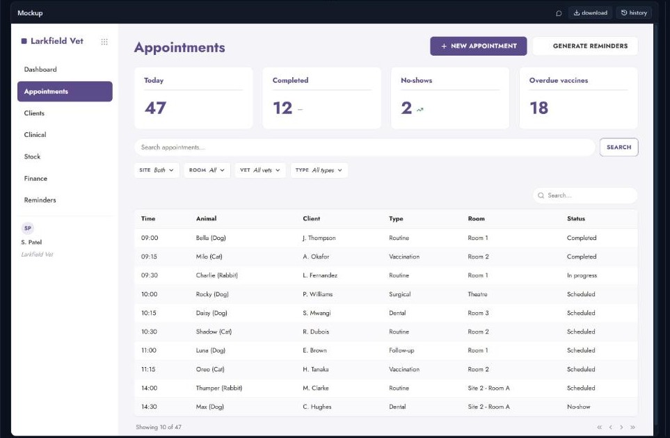
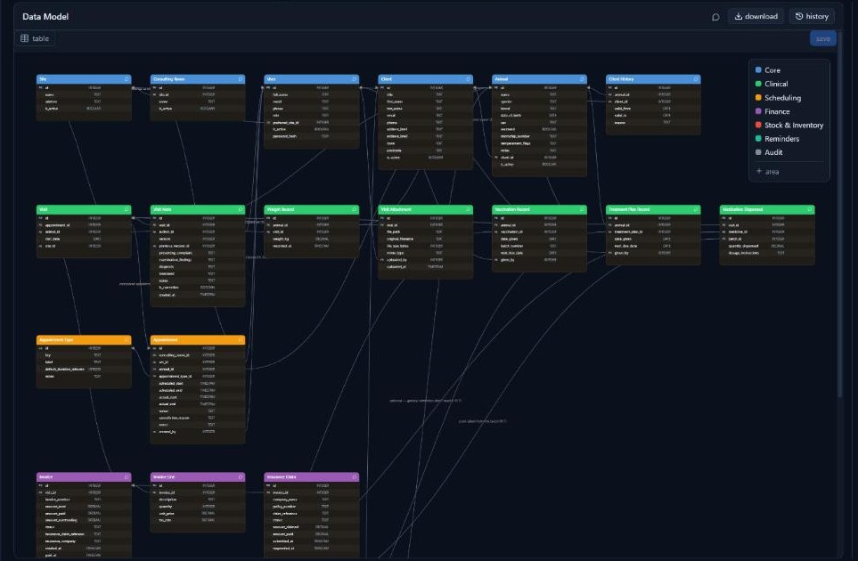
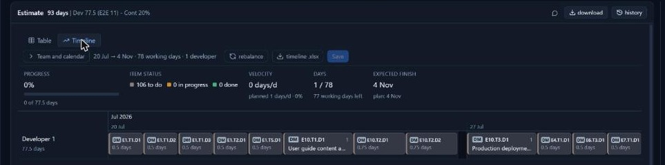

<div align="center">

# Dyla

### Develop Your Local Assistant

**An AI workspace that turns project work into deliverables you can actually send —
running on a model on your own machine.**

Briefs · Estimates · Data models · Mockups · Test plans · Decks
→ Word, Excel, PowerPoint, draw.io, HTML

</div>

---

Dyla is not a chatbot with a save button. The **documents are the point**: an agent writes
them as validated JSON, you review and correct them in a viewer, and the backend renders
them into the files you have to hand to someone. Everything runs on your machine — your
projects never leave it.

**The local model is the proposal, not the fallback.** Using a frontier model through an
API is the easy road, and it is here as an option. The interesting question is what a
small model on your own hardware can do when it is put inside a real workflow instead of a
chat window. That is what this project is about.



## What it produces

| | |
|---|---|
|  |  |
| An editable ER diagram from the requirements | A plan in days, on a schedule board |

The chat discusses, the viewer shows. The agent never pastes tables into the conversation:
it writes the document as a draft, you argue about it by referring to rows by id, and when
you are happy you mark it confirmed. Correct a number in the viewer and every export
follows.

## Quick start

```powershell
# 1. Python 3.10+ (python.org — tick "Add Python to PATH")
# 2. Claude Code — the engine. The Python package alone is not enough.
npm install -g @anthropic-ai/claude-code    # needs Node.js
claude                                       # run once to sign in
```

Then `start.bat` (or `.\start.ps1`) on Windows, `./start.sh` on macOS/Linux. It checks the
prerequisites, creates a `.venv`, installs dependencies, and opens Dyla at
http://localhost:3000.

## The model is yours to pick

Two profiles, from the menu at the bottom left:

- **local** — a model on this machine, served by `llama-server` speaking the Anthropic API
  natively. **The default.** Dyla downloads a prebuilt `llama-server` and the model you
  choose, and starts the engine itself with flags matched to your hardware.
- **sonnet** — Claude Sonnet through your Claude Code login. The comparison, and the
  fallback when the work needs it.

**16 GB of memory is the floor; 24 GB or more is where it stops being a compromise.**
Suggested models, downloadable from the settings panel:

| Model | On disk | Wants | |
|---|---|---|---|
| **Gemma 4 12B** | 7 GB | 12 GB | Smallest worth putting inside a real workflow |
| **Gemma 4 26B-A4B** | 14 GB | 18 GB | Mixture of experts — best quality-to-hardware ratio |
| **Gemma 4 31B** | 17 GB | 22 GB | Dense, steadier on long reasoning |
| **Qwen3.6 35B-A3B** | 18 GB | 24 GB | **The one we run** — everything here is shaped around it |
| Qwen3.6 35B-A3B (MXFP4) | 22 GB | 28 GB | Native four-bit on recent NVIDIA cards |
| Qwen3.6 35B-A3B (IQ3) | 13 GB | 18 GB | Three-bit — fits where the full one will not |

Bring your own `.gguf` too: point the panel at a file you already have. Until there is a
model to run, the local profile stays hidden and Dyla starts on `sonnet`.

## Why Claude Code — and where it goes next

Dyla drives the agent through **Claude Code**, today the most capable and most widely used
agentic orchestrator: mature tool use, skills, hooks, an SDK, a real community. It is the
right default, and the reason a local model behaves well here is that Claude Code was tuned
to death and Dyla borrows that.

But the architecture underneath — skills as plain prompts, deliverables as validated JSON,
exports generated from that JSON — **is not wedded to any one orchestrator.** The direction
is to adapt others too, open-source ones included, so each setup can pick the orchestrator
that gets the most out of *its* model: the same workflow tuned for fewer tokens on one, for
higher quality on another. The orchestrator should be a choice, not a dependency.

## Roadmap

- **OpenRouter and other model providers** — one more profile beside `local` and `sonnet`,
  so any hosted model is a drop-in.
- **Alternative orchestrators**, open-source included — see above. Skills and schemas stay;
  the driver becomes swappable.
- **Per-model tuning** — the sampling, the reminders, the tool set adjusted to the model in
  front of them, to trade tokens against quality deliberately.

Contributions welcome on any of these.

## Making it yours

Dyla ships with one workflow — software delivery, where it came from — but that is an
example, not the point. What ships is a direction and a structure, meant to be bent to your
own work.

**Open [Claude Code](https://claude.com/claude-code) in a checkout and ask it to help.** The
`CLAUDE.md` at the root has a section written for exactly that: it walks you through adding
a skill, giving its document a schema, wiring the export, reworking the estimation rules
into your own. That is why the whole `.claude/` folder is part of the repo, not hidden —
the assistant that guides the change ships with the thing it changes.

By hand: a **skill** is one folder in `.claude/skills/` with a single markdown file — plain
instructions, no code. Colours are CSS variables in `web/src/styles/theme.css`
(`npm run build` and the app follows). The interface **language** is in Settings, empty by
default so the agent answers in whatever you write to it.

| Skill | What it produces |
|---|---|
| `/meeting-notes` | A meeting write-up: decisions, open points, actions with an owner |
| `/meeting` | Folds a transcript into the brief, collects open questions and people |
| `/data-model` | Entities, fields and relationships, with an editable ER diagram |
| `/estimate` | A plan in days: epics, tasks, end-to-end tests, contingency |
| `/dev-tasks` | Breaks each task into assignable pieces of work |
| `/mockup` | Composed page mockups from a themed component library |
| `/test-plan` | Test cases traced back to the epics they cover |
| `/deck` | Kick-off, status and demo decks, as PowerPoint and HTML |
| `/ticket` | Triage for a maintenance ticket on a delivered project |
| `/pipeline` | Runs the sequence end to end |

## Under the hood

- **Meeting recordings become transcripts** locally (faster-whisper, on the CPU — nothing
  is uploaded). Input PDFs, Word, Excel and PowerPoint are read and quotable.
- **Web search is ours** — three public engines scraped in parallel, merged, pages
  extracted to clean markdown. No API key, no third party.
- **It can look at pictures** if your model is multimodal.
- **The model carries only the tools it can use** — disabled tools never enter the prompt;
  here that took a cold turn from 55s to 24s.

## Development

```powershell
pip install -r requirements-dev.txt
python -m pytest server/tests          # backend
cd web; npm install; npm run test      # frontend
npm run build                          # rebuilds web/dist (committed on purpose)
```

FastAPI + the Claude Agent SDK on the back, React + Vite on the front. `web/dist` is
committed so people can run Dyla without Node — rebuild and commit it **together with** the
sources.

> **Tested on Windows.** macOS and Linux are handled in the code and covered by tests, with
> a `start.sh` — but nobody has yet run Dyla end to end on either. If you are first, that is
> the caveat.

## Licence

MIT. See [LICENSE](LICENSE).
